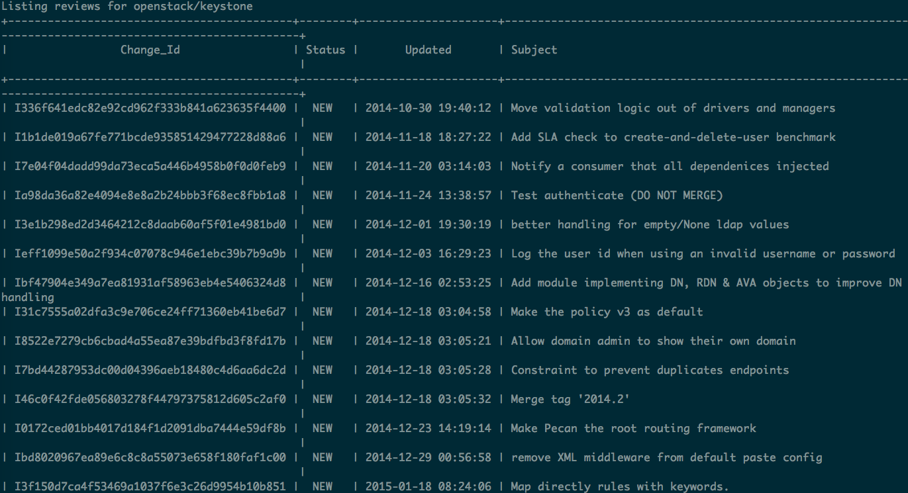

Project Goal
============

#. Have a code review tool for Gerrit in Vim
   - I like moving around diffs in Vim
#. Be able to review offline

Why?

#. I don't like the Gerrit web interface
#. I tend to have extra time to review at times when
   I don't have internet access.

Gertty exists. Why not use it?

#. The interface is sluggish. Probably related to urwnd.
#. Moving between screens and lines in the diff isn't
   awesome.
#. I AM. I'm just using it as a library instead of an application.

Today's Gertty Functionality
============================

This just highlights the things that I want to replicate in Vim and not all
of the functionality.

Gertty Project List
-------------------

Gertty Review List
------------------

Gertty Diff
-----------

Added A CLI
===========

To add the functions necessary for Vim use I added a simple CLI. Hey, and
it looks like the OpenStack client output!

New CLI Project List
--------------------

.. image:: docs/Screenshot-2015-03-20-12.22.02.png

New CLI Review List
-------------------

Read-Only Vim Functionality
===========================

This is what I have gotten done so far. To be clean up and published
here soon.

Vim Project List
----------------

Vim Review List
---------------

Vim View Commit Message
-----------------------

.. image:: docs/Screenshot-2015-03-20-12.23.34.png

Vim Diff
--------

Future Functionality
====================

#. Show comments in the diff
#. Allow new comments to be added
#. Publish a review + vote
